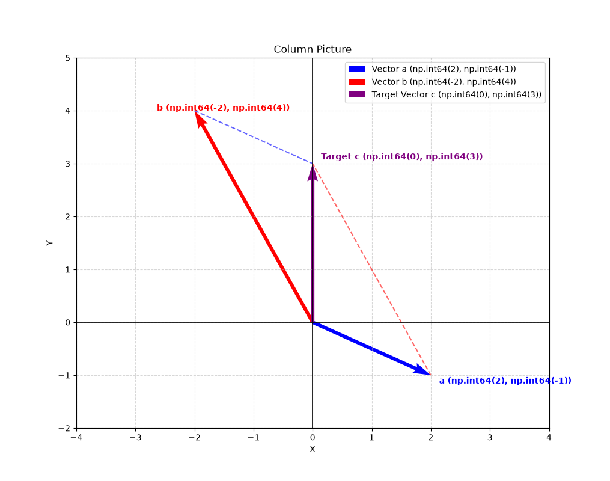
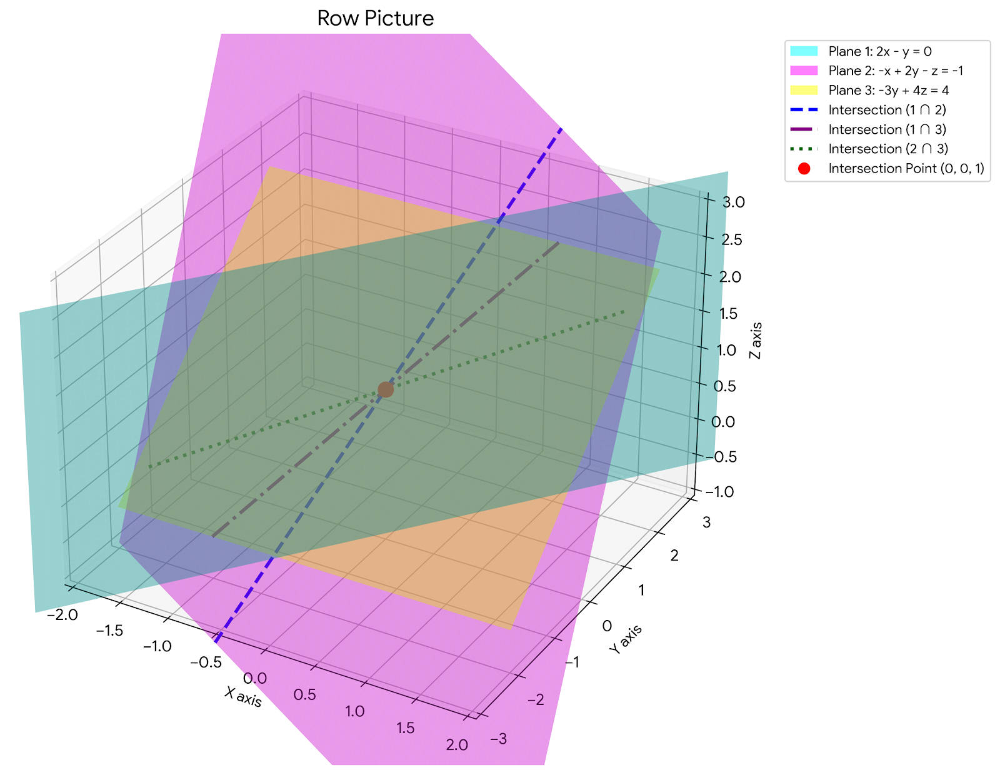
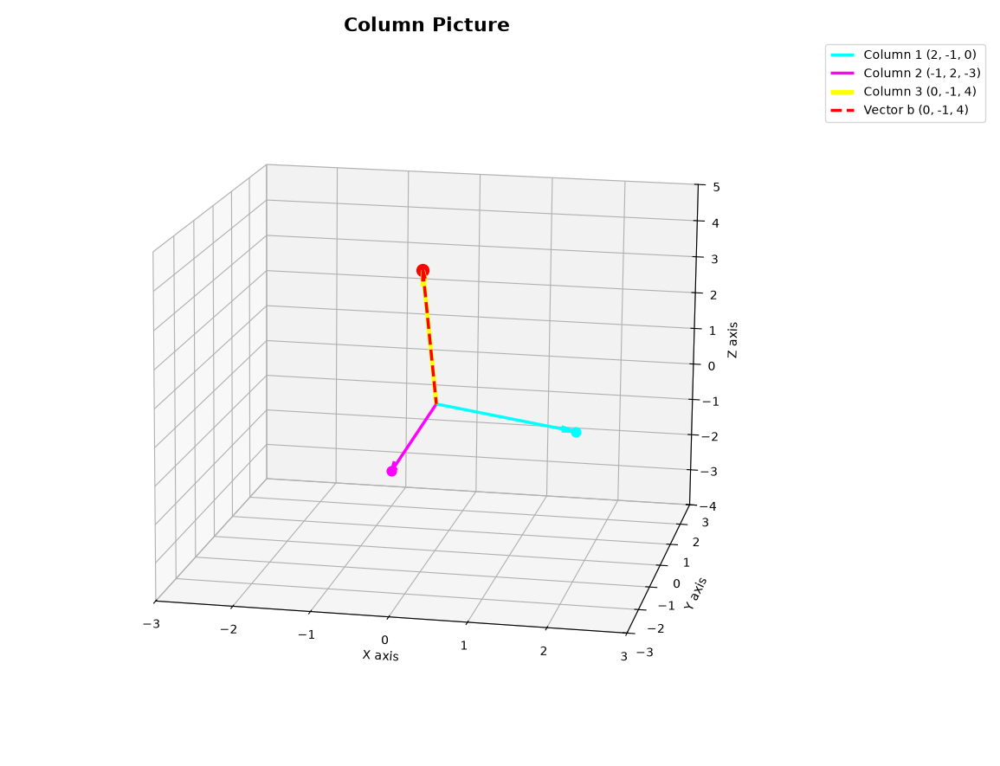

# 线性方程的几何表示

## 一元一次方程

一元一次方程的几何解释就是一个值，如 $4x=40$ ，它的表示就是$x=5$这个值。

## 二元一次方程

二元一次方程的几何表示是一个二维象限中的一个点，如：

$$
2x - y = 0 \\
-x + 2y = 3
$$

这组方程组在线性代数中，可以用矩阵乘法来表示，如下：

$$
\begin{bmatrix}
2 & -1 \\
-1 & 2
\end{bmatrix}
\begin{bmatrix}
x \\
y
\end{bmatrix}
=
\begin{bmatrix}
0 \\
3
\end{bmatrix}
$$

如果我们用$A$ 替代左边的二维矩阵，$X$替代未知数矩阵，$B$来表示结果，那么最终可以用下式表示，类似于一元一次方程，但是实际上是一个矩阵乘法：

$$
A * X = B
$$

### Row Picture

矩阵存在行(row)和(column)的概念，因此在几何上，可以用row picture和column picture来表示这样的二元一次方程，二元一次方程的row picture表示的就是在二维座标系中两条线的相交点：

### Column Picture

用column picture来表达的话，我们先看数学表达式，实际上就是x乘以列1， 加上y 乘以列2:

$$
x
\begin{bmatrix}
2 \\
-1
\end{bmatrix}
+
y
\begin{bmatrix}
-1 \\
2
\end{bmatrix}
=
\begin{bmatrix}
0 \\
3
\end{bmatrix}
$$

这样它的求解就是多少个$ \begin{bmatrix}2 \\\ -1\end{bmatrix}$ 加上多少个$\begin{bmatrix} -1 \\ 2 \end{bmatrix}$ 等于$\begin{bmatrix}0 \\ 3\end{bmatrix}$.

在二维坐标系表示就是向量加法：

从column picture可以看出，通过选取不同的(x, y)，实际上我们的结果可以铺满整个平面。

## 三元一次方程

三元一次方程如果有解，实际上就是在一个三维空间里寻找一个符合条件的点。我们先看三元一次方程组：

$$
2x - y = 0\\
-x + 2y - z = -1\\
-3y + 4z = 4
$$

用矩阵乘法表示就是：$AX = B$. 其中：

$$
A = \begin{bmatrix}
2 & -1 & 0\\
1 & 2 & -1\\
0& -3& 4
\end{bmatrix}
$$

$$
X = \begin{bmatrix}
x\\
y\\
z
\end{bmatrix}
$$

$$
B = \begin{bmatrix}
0\\
-1\\
4
\end{bmatrix}
$$

### Row Picture

对应的row picture就是一个三维坐标系下，三个方程各自代表一个平面：

在row picture的几何表示里，如果有两个平面平行，那么我们就无法得到唯一解。

### Column Picture

在列向量视角里，就变成了：

$$
x \begin{bmatrix}
2\\
-1\\
0
\end{bmatrix} 
+ y 
\begin{bmatrix}
-1\\
2\\
3
\end{bmatrix}
+ z \begin{bmatrix}
0\\
-1\\
4
\end{bmatrix}
= \begin{bmatrix}
0\\
-1\\
4
\end{bmatrix}
$$

Column Picture也就是三维坐标系里三个向量的不同倍数组合，得到第四个坐标：

当然，从这个列向量中，刚好结果就是(0, 0, 1). 实际上，通过组合不同的(x, y, z)，可以得到覆盖全三维的点。（前提是这三个向量不在一个平面上）
